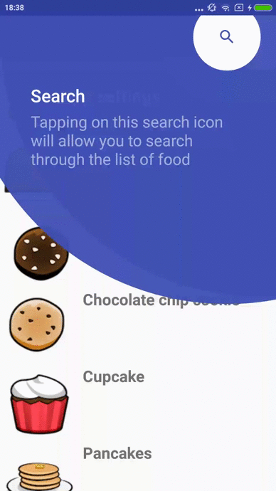

# tapTargetViewExample
An example of using a TapTargetView for Android. 
Made on the basis of the following tutorial - https://www.raywenderlich.com/5194-taptargetview-for-android-tutorial.

When a user sees an element for the first time, a TapTargetView is displayed. 
After that, a variable is written to the SharedPreferences and no more prompt will pop up.
